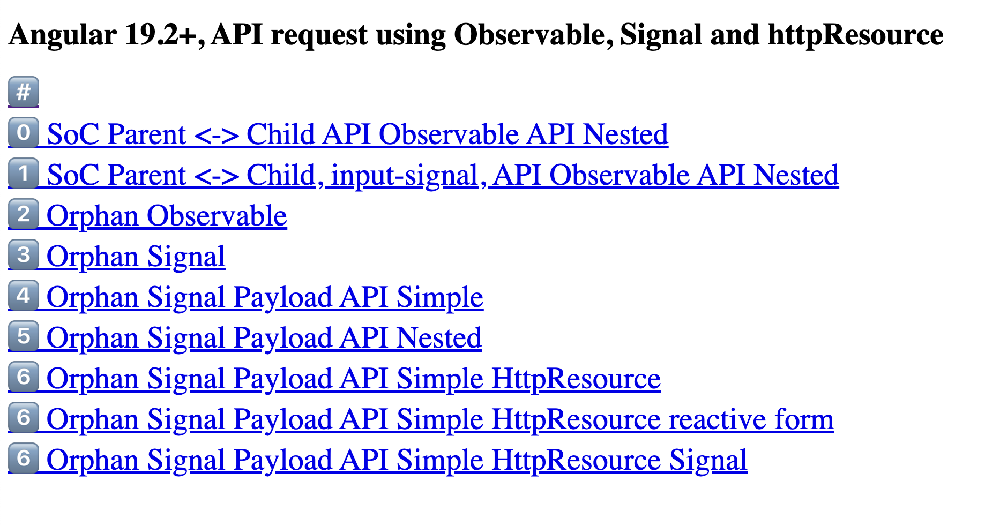

# Angular (19.2+) Observable + Signals for handling API requests

## Goals AC's

1.	Get all country names and display on the page: 
https://restcountries.com/v3.1/independent?fields=name

2.	Select a country and Show the flag: 
https://restcountries.com/v3.1/name/Grenada?fields=name,flags

3.	Search countries by language: 
https://restcountries.com/v3.1/lang/spanish?fields=name  

---

## Demo



---

## Solution Arquitecture

```js
src/
└── app/
     ├── SoC/
          └── input/output   // Separation of Concern using Parent and Child, @Input()/@Output()
          └── input/output   // Separation of Concern using Parent and Child, input signal/@Output()  
     ├── orphan-observable/  // single Component, managing API request using Observables
     ├── orphan-signal/      // single Component, managing API request using Signals
     ├── orphan-signal-payload-simple/  // single Component, managing API request using Signal
     ├── orphan-signal-payload-nested/  // single Component, managing complex API request using Signal
     ├── orphan-signal-payload-httpresource // simple Component, managing API request using Signals with httpResouce asynchronous data fetching
     ├── orphan-signal-payload-httpresource-reactiveForm // Shows how the new signals approach replaces the traditional RxJS pattern
     ├── orphan-signal-payload-httpresource-signal // Pure signal-based approach. Using direct signal binding with [value] and (input). Simple event handler to update the signal
     |
     ├── app.component.ts
     ├── auth.interceptor.ts
     └── http.interceptor.ts
```

## A few technical mentions

🟡 `httpResource` asynchronous data fetching (Angular 19.2+)
This feature simplifies working with RESTful APIs by providing a higher-level abstraction for interacting with resources on a server.

It is designed to reduce boilerplate code when performing common CRUD (Create, Read, Update, Delete) operations. Instead of manually writing HTTP requests for each operation, you can use HttpResource to define a resource and automatically generate methods for interacting with it. Define a resource once, and HttpResource provides methods like get(), post(), put(), delete(), etc., out of the box.

The httpResource function creates a Resource that performs an HTTP GET request to a specified URL. When provided with a reactive function for the URL, the resource updates automatically as the URL changes via signals. Under the hood, httpResource utilizes Angular's HttpClient, ensuring compatibility with existing interceptors and testing utilities.
`Instead of manually subscribing inside an effect, rxResource allows developers to declare request dependencies and automatically updates when the dependent Signal changes.`

🟡 `Signal with httpresource (with paramenters)`
- Reactive Forms instead template-driven
- using Signals for a clean, reactive data flow and reactive state management
- Using httpResource, with parameter, for automatic data fetching
- Implements debouncing for performance + Handles errors, in separates function for reusability
- Provides computed values for derived state
- Stays within the signals paradigm and use signals' effect() to automatically handle cleanup (instead OnInit/OnDestroy + No need for manual subscription management)


🟡 `SoC`
This example demonstrates the separation of concerns between the: 
`service (responsible for fetching data)`, 
`smart component (responsible for handling business logic and passing data to the dummy component)`, `dummy component (responsible for rendering the UI)` 

🟡 `Modern StandAlone Components`:
I directly bootstrap the component itself, not its module. This is because standalone components have their own injectors and don't rely on a root module for dependency injection. Promotes code maintainability, reusability, and smaller application size.

🟡 Implemented `TSP mechanism`:
I'm using `Tree Shakeable Providers` in `Services` by using the `providedIn` attribute, this will provide the benefits of both `tree shaking performance` and `dependency injection`,
meaning that our services will not be included in the final bundle unless they are being used by other services or components. As a result we reduce the bundle size by removing unused code from the bundle.

🟡 `RxJS`
- `takeUntilDestroyed(this.destroyRef)` to automatically unsubscribe when the component is destroyed, simplifying the cleanup process even further
- `shareReplay(1)` because multiple components might subscribe to the same observable

🟡 `Signals and Observables`
- Prefer Signals Over BehaviorSubjects for State Management
- Signals will hold state values and trigger reactivity in our component, whereas Observables are streams of data that may emit multiple values over time.

🟡 `OnPush Change Detection and Reactive Signal` 
I Changed detection OnPush: So only change detection is triggered locally to the Signal change (changeDetection: ChangeDetectionStrategy.OnPush)

🟡 `TypeScript`
- TS Generic Type Parameter <T>
T can replaced with: user, photos, comments, etc. 
The method returns an Observable of `type T`

🟡 `Dependency Injection Pattern`:
I'm using Modern `Dependency Injection functions`, instead traditional `constructor-based dependency injection`as result I will have a more Modular, Less Complex

🟡 Implement Caching:
-- `Cache API Service Calls`
Caches identical HTTP requests within a single component:
I'm using `shareReplay()` to improve efficiency, ensuring that all subscribers receive the most recent data without triggering multiple HTTP requests.


🟡 `DestroyRef & takeUntilDestroyed()`: Angular 16+
I'm using provides a more declarative and efficient way to handle automatic cleanup tasks when a component or service is destroyed: `takeUntilDestroyed(this.destroyRef)` to automatically unsubscribe when the component is destroyed, simplifying the cleanup process even further


🟡 `Angular control flows` syntax: `@for`, `@empty`, etc
I'm using modern angular control flows, offering better runtime performance than *ngFor (especially for large lists)

🟡 `Function-based Interceptor` (optional here): 
It also showcases the usage of an interceptor to log HTTP requests and responses. While not necessary for this example, it can be useful for debugging and monitoring purposes (WIP)


---
### :100: <i>Thanks!</i>
#### Now, don't be an stranger. Let's stay in touch!

<a href="https://github.com/leolanese" target="_blank" rel="noopener noreferrer">
  
</a>

##### :radio_button: gitroll: <a href="https://gitroll.io/profile/uCOZ9SM8b7ne9h17NuPuKVky9uFh2" target="_blank">LeoLanese</a>
##### :radio_button: Linkedin: <a href="https://www.linkedin.com/in/leolanese/" target="_blank">LeoLanese</a>
##### :radio_button: Twitter: <a href="https://twitter.com/LeoLanese" target="_blank">@LeoLanese</a>
##### :radio_button: Portfolio: <a href="https://www.leolanese.com" target="_blank">www.leolanese.com</a>
##### :radio_button: DEV.to: <a href="https://www.dev.to/leolanese" target="_blank">dev.to/leolanese</a>
##### :radio_button: Blog: <a href="https://www.leolanese.com/blog" target="_blank">leolanese.com/blog</a>
##### :radio_button: Questions / Suggestions / Recommendations: `developer@leolanese.com` email me: <a href="mailto:developer@leolanese.com">developer@leolanese.com</a>

